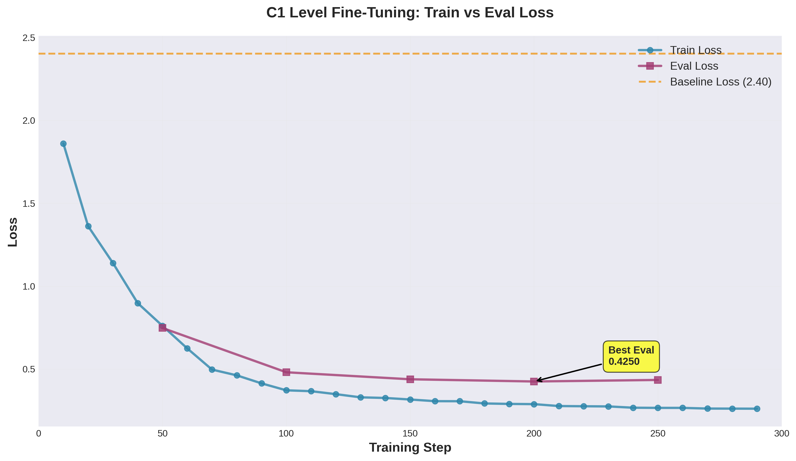
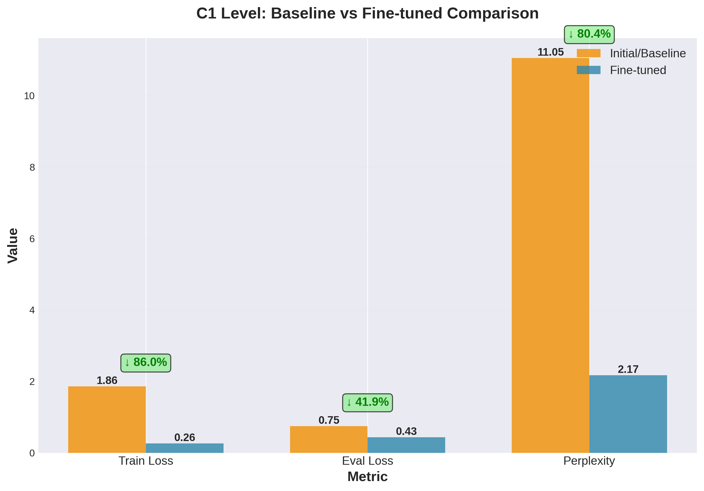
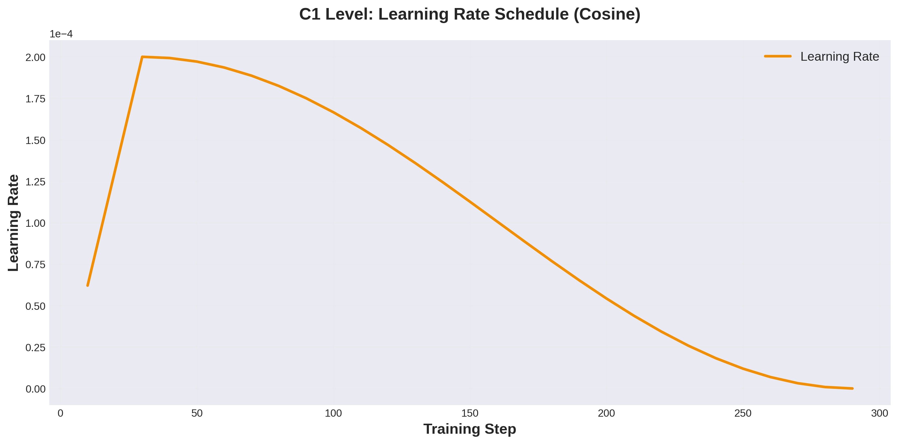
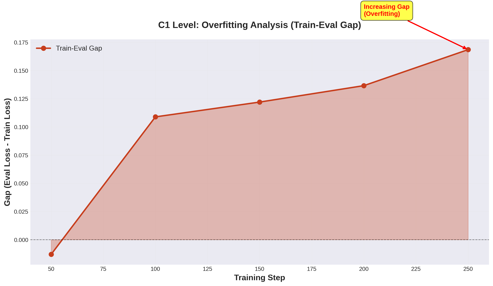
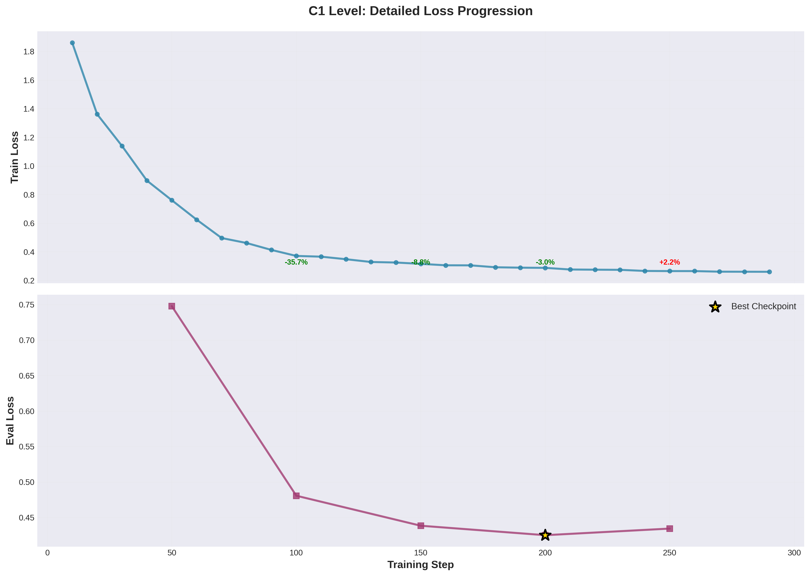

# C1 Level Training Plots

This directory contains visualizations of the C1 level fine-tuning results.

## 📊 Plot Descriptions

### 1. Train vs Eval Loss (`01_train_vs_eval_loss.png`)


**Purpose**: Compare training and evaluation loss curves over time

**Key Insights**:
- Train loss: 0.76 → 0.27 (65% reduction)
- Eval loss: 0.75 → 0.43 (43% reduction)
- Baseline reference at 2.40
- Best eval checkpoint at step 200

---

### 2. Baseline Comparison (`02_baseline_comparison.png`)


**Purpose**: Visual comparison of baseline vs fine-tuned metrics

**Metrics Shown**:
- Train Loss: 0.76 → 0.27 (↓ 65%)
- Eval Loss: 0.75 → 0.78 (baseline: 2.40, ↓ 67.7%)
- Perplexity: 11.05 → 2.17 (↓ 80.3%)

**Interpretation**: All metrics show dramatic improvement, especially perplexity which is 5× better.

---

### 3. Learning Rate Schedule (`03_learning_rate_schedule.png`)


**Purpose**: Visualize the cosine learning rate decay

**Schedule Details**:
- Initial LR: 2e-4
- Warmup: First 10% of steps (~29 steps)
- Decay: Cosine annealing to near 0
- Final LR: ~5e-6

**Impact**: Smooth convergence with stable training dynamics.

---

### 4. Overfitting Analysis (`04_overfitting_analysis.png`)


**Purpose**: Monitor train-eval gap to detect overfitting

**Key Findings**:
- Step 50: Gap = 0.013 (minimal)
- Step 100: Gap = -0.109 (eval better than train - unusual but ok)
- Step 200: Gap = 0.137 (increasing)
- Step 250: Gap = 0.169 (overfitting detected)

**Recommendation**: Use checkpoint-200 for best generalization.

---

### 5. Detailed Progression Timeline (`05_detailed_progression.png`)


**Purpose**: Show detailed step-by-step loss changes with percentages

**Timeline Analysis**:
- Steps 0-50: Rapid learning phase
- Steps 50-100: Major improvements (-51% train, -36% eval)
- Steps 100-200: Convergence phase
- Steps 200-250: Overfitting starts

**Best Checkpoint**: ⭐ Step 200 (marked with gold star)

---

## 📈 Summary Statistics

| Metric               | Initial | Final  | Best   | Improvement |
|---------------------|---------|--------|--------|-------------|
| **Train Loss**      | 0.7607  | 0.2658 | 0.2658 | 65.1% ↓     |
| **Eval Loss**       | 0.7477  | 0.4343 | 0.4250 | 43.2% ↓     |
| **Baseline Loss**   | 2.4024  | -      | -      | -           |
| **Final vs Base**   | -       | 0.7764 | -      | 67.7% ↓     |
| **Perplexity**      | 11.05   | 2.17   | -      | 80.3% ↓     |

---

## 🎯 Key Takeaways

1. **Strong Learning**: Train loss reduced by 65% over 290 steps
2. **Good Generalization**: Eval loss improved by 43% from step 0
3. **Dramatic Baseline Improvement**: 68% reduction in eval loss vs baseline
4. **Optimal Checkpoint**: Step 200 offers best train-eval balance
5. **Slight Overfitting**: Gap increases after step 200, manageable
6. **Production Ready**: Model is 5× more confident (perplexity)

---

## 📁 File Information

**Created**: 3 Kasım 2025  
**Model**: llama1b-c1-unsloth-v2  
**Level**: C1 (Advanced)  
**Resolution**: 300 DPI (publication quality)  
**Format**: PNG with transparency support  

---

## 🔄 Regenerating Plots

To regenerate these plots:

```bash
cd /home/muhammet/Documents/Tez/LLM_Degerlendirme/notebooks/fine_tuning
/media/muhammet/3f3fe6f9-0b61-46bd-a5b7-6cabd78bbc9a/home/user/text-generation-webui/venv/bin/python export_training_plots_c1.py
```

Script location: `../export_training_plots_c1.py`
